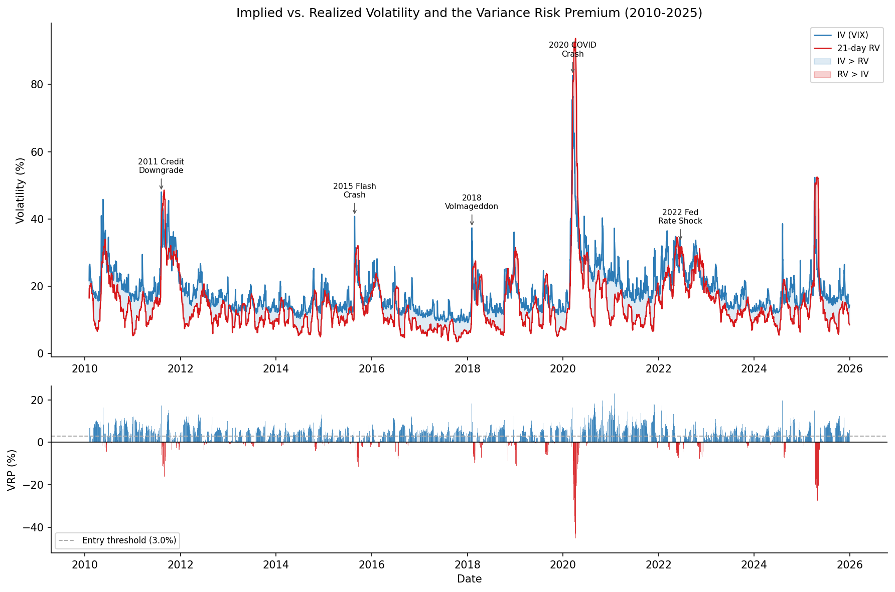
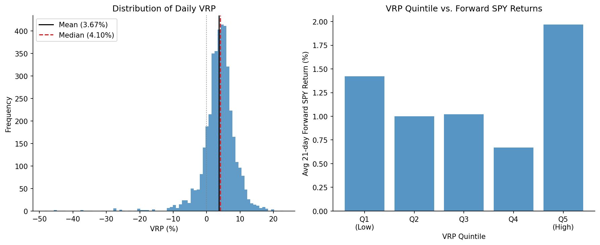
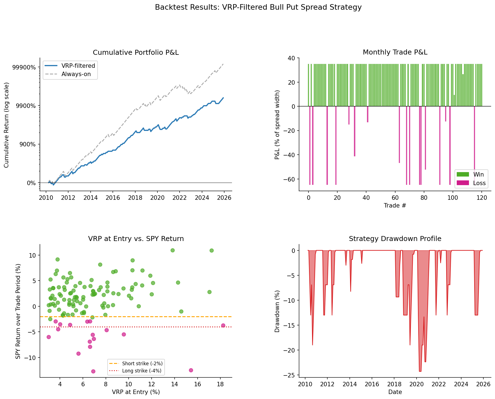
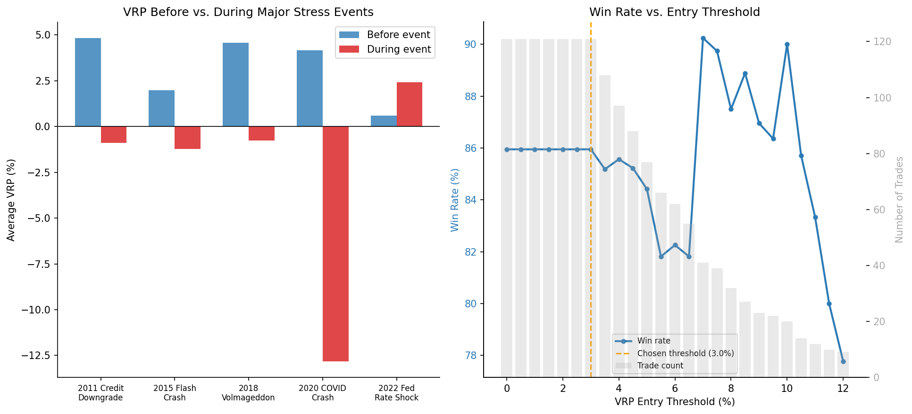

# SPX Variance Risk Premium — Bull Put Spread Backtest

A systematic options strategy that exploits the persistent gap between implied and realized volatility on SPY. The VIX consistently prices in more volatility than actually materializes, creating a structural edge for options sellers. This project quantifies that edge and backtests a defined-risk credit spread strategy on top of it.

## Strategy

**Signal:** VRP = VIX − RV₂₁ > 3%  
**Instrument:** SPY bull put credit spread, entered at month-end  
**Structure:** short put at −2%, long put at −4% (defined max loss), 35% premium collected, 20% capital per trade  
**Hold:** one calendar month

The VRP filter skips months where the premium isn't elevated enough to justify the risk — improving risk-adjusted performance versus trading every month.

## Results (2010–2025, real SPY + VIX data)

| Metric | VRP-Filtered | Always-On |
|---|---|---|
| Trades | 121 | 184 |
| Win Rate | 86.0% | 85.3% |
| Annualized Return | 37.5% | 56.2% |
| Max Drawdown | −24.3% | −40.7% |
| Annualized Sharpe | 2.47 | — |

The filter doesn't improve win rate much — the base rate is already high. Its main effect is cutting max drawdown from −40.7% to −24.3% by skipping low-premium months. The always-on strategy makes more money purely by compounding more trades.

## Output






## Setup

```bash
python -m venv venv
source venv/bin/activate
pip install -r requirements.txt
```

## Usage

```bash
python analysis.py        # downloads data, runs backtest, saves figures + stats.json
```

Figures are written to `output/`. Strategy parameters (threshold, spread width, capital allocation) are constants at the top of `analysis.py`.

## Data

Daily SPY prices and CBOE VIX index via [yfinance](https://github.com/ranaroussi/yfinance). Sample: Feb 2010 – Dec 2025 (4,002 trading days).

## Notes

- RV is computed as the 21-day rolling std of log-returns, annualized: `σ × √252 × 100`
- Sharpe is annualized from trade-month returns using `×√12` — this overstates the ratio slightly since only ~7–8 months per year are active
- Sample period was historically favorable for US equities; live results would likely be more modest

## Limitations

The 35% premium ratio is a fixed approximation and won't hold across all market conditions. Real premiums depend on skew, term structure, and days to expiration. Slippage and commission costs are not modeled, which matters more for the long put leg since far OTM puts can be illiquid. No intra-month position management is simulated either — in practice you would close early if the short strike was threatened, which would change the loss distribution.
